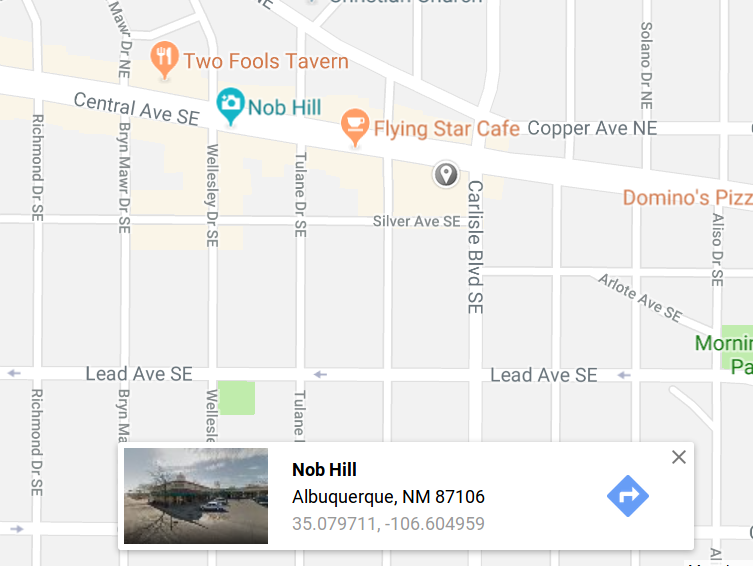

Organic Books is situated in the Historic Nob Hill Business District of Albuquerque, New Mexico.

Nob Hill is a thriving blend of eclectic shops, swanky dining and chic nightspots. Its Route 66 architecture and neon signs, combined with predominantly locally owned shops, galleries and restaurants, make Nob Hill a hip and fashionable area. It is highly walkable and populated with educated people who have disposable income. It is very near the state’s flagship University of New Mexico and the Central New Mexico Community College. Traffic flow is steady with autos and public transportation. It is a tourist destination.  

Within a five-mile radius, no bookstores do what we do. To our knowledge, Nob Hill has not been served by a bookstore in five years.

